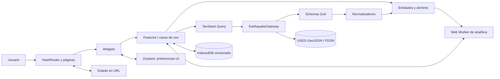
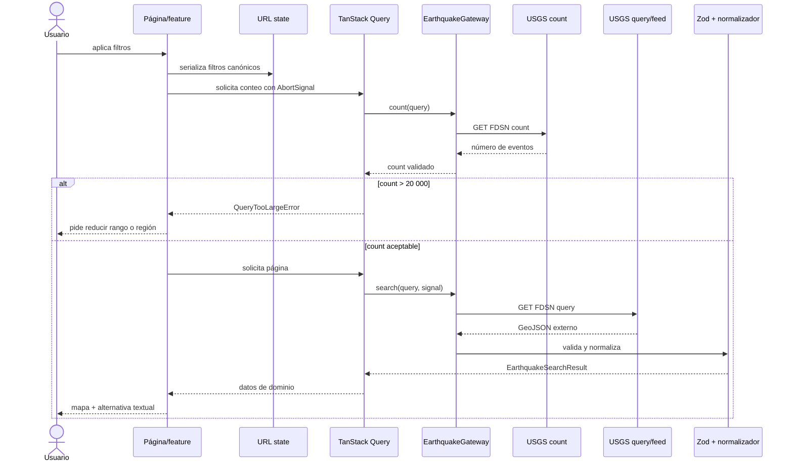
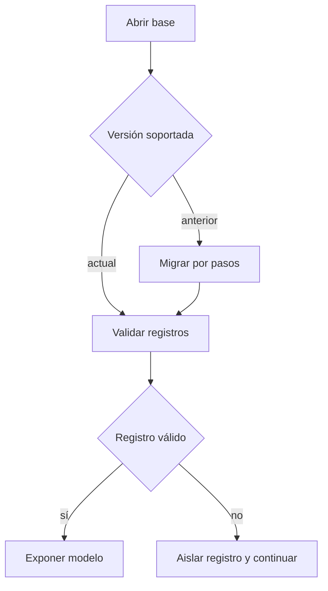

# Arquitectura de SismoScope

## Objetivos

La arquitectura separa el vocabulario sísmico, la infraestructura externa y la presentación para que una respuesta cambiante de USGS no se propague por toda la interfaz. También distingue cuatro clases de estado —remoto, URL, preferencias y persistencia— y conserva una ruta de ejecución fuera del hilo principal para analítica pesada.

## Vista general



La flecha representa conocimiento o uso. El dominio no conoce React, TanStack Query, IndexedDB, Leaflet, ECharts ni el formato externo de USGS.

## Capas y módulos

### `app`

Compone providers, router, configuración global, estilos y límites de error. Es el composition root: conecta implementaciones de infraestructura con contratos y configura dependencias transversales.

### `pages`

Una página representa una ruta. Interpreta parámetros ya validados, compone widgets/features y define límites de carga o error. No normaliza respuestas ni contiene algoritmos de dominio.

### `widgets`

Bloques de interfaz con una responsabilidad visible: mapa, tabla, filtros, panel de analítica o shell. Pueden coordinar varias primitivas, pero no conocen URLs externas ni persisten datos directamente.

### `features`

Casos de uso iniciados por el usuario: buscar, seleccionar, guardar, marcar favorito, exportar o cambiar el viewport. Una feature puede depender de entidades y `shared`; las features no se importan entre sí de forma arbitraria. La coordinación transversal se eleva a una página o widget.

### `entities`

Modelos internos, invariantes, selectores y transformaciones puras de terremotos, regiones y búsquedas guardadas. Esta capa no depende de React ni de detalles de transporte.

### `shared`

Infraestructura y primitivas reutilizables con propósito concreto: cliente HTTP, errores tipados, configuración, persistencia, internacionalización, utilidades y UI accesible. `shared` no importa páginas, widgets ni features.

### `workers`

Adaptadores de mensajería y cálculos serializables para analítica. Las funciones estadísticas puras viven fuera del wrapper del worker para poder probarlas sin un navegador.

## Reglas de dependencia

```text
app/pages ──► widgets ──► features ──► entities
     │             │           │           │
     └─────────────┴───────────┴──────────► shared
workers ──────────────────────────────────► entities/shared (sólo módulos puros)
```

Reglas exigibles en revisión:

1. El dominio no importa React ni librerías de red, almacenamiento o visualización.
2. La UI no importa schemas GeoJSON externos ni construye endpoints USGS.
3. Toda entrada de red o importación de archivo empieza como `unknown` y atraviesa un schema.
4. Los normalizadores son el único puente entre schemas USGS y modelos internos.
5. Las URLs, límites regionales y feeds residen en configuración tipada.
6. No se crean barrels globales; los imports apuntan a contratos públicos pequeños para evitar ciclos.
7. Los efectos viven en gateways, hooks de consulta o adaptadores; estadísticas, Haversine y serializadores se mantienen puros.

## Separación del estado

| Estado                     | Propietario            | Ejemplos                                                              | Persistencia                  |
| -------------------------- | ---------------------- | --------------------------------------------------------------------- | ----------------------------- |
| Remoto                     | TanStack Query         | feeds, conteos, páginas de búsqueda, detalle                          | caché de memoria de la sesión |
| Navegación                 | URL validada           | fechas, magnitud, región, orden, página, vista, selección compartible | historial y enlace compartido |
| Preferencias UI            | Zustand                | tema, zona horaria, densidad, paneles, mapa, autoactualización        | adaptador local controlado    |
| Datos elegidos por usuario | Repositorios IndexedDB | búsquedas y favoritos; extensible a historial/comparaciones           | base versionada y migrable    |
| Estado efímero             | React local            | foco, dialog abierto, texto aún no aplicado                           | ninguno                       |

Ninguna copia manual del resultado remoto se introduce en Zustand. Los filtros aplicados se derivan de la URL; el formulario puede mantener un borrador local hasta que el usuario confirma la búsqueda.

## Flujo de datos



Las búsquedas recientes pueden usar un feed tipado sin conteo previo cuando el feed oficial ya define un conjunto acotado. Las consultas históricas y avanzadas siempre consultan `count` antes de su primera descarga.

## Queries y cancelación

Las query keys se crean en una factoría tipada a partir de filtros canónicos. No contienen objetos mutables ni fechas locales. Cada función de consulta recibe el `AbortSignal` de TanStack Query y lo entrega al gateway.

- Feeds: frescura corta y refetch explícito o polling sólo en modo Live.
- Detalles: mayor `staleTime` porque cambian con menos frecuencia, manteniendo una acción de actualización.
- Conteos y búsquedas: clave determinada por los parámetros normalizados; al paginar se conserva el resultado anterior cuando evita parpadeos engañosos.
- Reintentos: sólo errores de red, timeout o HTTP recuperable, con límite finito. No se reintentan validaciones, consultas demasiado grandes ni abortos.
- Visibilidad: el modo Live evita polling innecesario cuando el documento no está visible.

## Frontera USGS

`EarthquakeGateway` expone operaciones de dominio: feed, conteo, búsqueda y detalle. La implementación HTTP:

1. Construye parámetros con `URLSearchParams` y valores UTC.
2. Añade `format=geojson`, `eventtype=earthquake` y `jsonerror=true` en búsquedas.
3. Impide mezclar rectángulo y círculo salvo que el contrato lo declare como intersección.
4. Aplica timeout y cancelación.
5. Distingue red, HTTP, rate limit, validación y exceso de resultados.
6. Valida que `detail` sea HTTPS y pertenezca a la allowlist USGS antes de solicitarlo.
7. Valida la respuesta externa y normaliza valores ausentes como `null`, nunca como cadenas inventadas.

## Persistencia

IndexedDB se encapsula detrás de repositorios tipados; ningún componente abre transacciones directamente. Cada registro persistido contiene la versión necesaria para validar o migrar. En apertura:



Una entrada corrupta no impide iniciar la aplicación. Las respuestas grandes de USGS no se conservan indefinidamente: se persisten identificadores, filtros, preferencias y metadatos elegidos por el usuario.

## Analítica y workers

La feature crea un identificador de tarea monotónico, envía un dataset plano y recibe un resultado discriminado. Si cambia el dataset, cancela o marca obsoleta la tarea previa; una respuesta antigua nunca sustituye al análisis actual. El worker no importa React y sólo llama funciones estadísticas puras probadas de forma unitaria.

ECharts se importa dinámicamente al entrar en analítica. Cada gráfico dispone de resumen o tabla equivalente para no depender del canvas.

## Errores y observabilidad local

La taxonomía discriminada contiene red, HTTP, validación, rate limit, consulta demasiado grande, persistencia e inesperado. El gateway crea errores de infraestructura; las features los traducen a acciones recuperables; los límites de página y global impiden una pantalla en blanco.

En desarrollo se registra contexto estructurado sin respuestas completas sensibles. En producción no se envían telemetría ni datos a terceros y nunca se muestra un stack trace al usuario.

## Seguridad y privacidad

- Sin secretos ni backend; sólo endpoints públicos.
- Sin HTML externo ni `dangerouslySetInnerHTML`.
- URLs externas y de detalle sujetas a protocolo y hostname permitidos.
- Sin trackers ni geolocalización automática.
- Ubicación y datos guardados permanecen en el navegador y pueden eliminarse.
- Enlaces en nueva pestaña usan `noopener noreferrer`.

## Decisiones y trade-offs

| Decisión                             | Beneficio                                | Coste aceptado                                        |
| ------------------------------------ | ---------------------------------------- | ----------------------------------------------------- |
| Vite + aplicación estática           | Build simple y despliegue sin secretos   | Sin procesamiento de servidor ni SSR                  |
| `HashRouter`                         | Recargas fiables en Pages                | URLs con `#` y menor semántica del servidor           |
| Validación Zod completa              | Contiene cambios o corrupción externa    | CPU adicional en la frontera                          |
| TanStack Query + URL + Zustand + IDB | Propiedad clara de cada estado           | Más adaptadores que un store único                    |
| IndexedDB                            | Datos estructurados y migrables          | API asíncrona y migraciones explícitas                |
| Worker para analítica                | UI responsiva con datasets grandes       | Copia/serialización y protocolo de mensajes           |
| Tiles estándar OSM encapsuladas      | Acceso sin clave y proveedor sustituible | Dependencia de política/servicio externo; sin offline |

Los registros completos están en [`docs/adr`](docs/adr/).

## Límites conocidos

- El máximo de USGS es 20 000 eventos por consulta; la aplicación no intenta eludirlo.
- Explorer pagina las consultas y exporta únicamente los eventos de la página cargada; no descarga automáticamente el conjunto completo.
- Regiones aproximadas no deben interpretarse como límites científicos oficiales.
- La disponibilidad offline se limita al shell y datos que ya permanezcan en el navegador; las tiles no se precargan.
- El comparador actual cubre Perú frente al mundo y semanas consecutivas; datasets configurables, comparaciones persistidas, i18n y un Storybook más amplio quedan como evoluciones.
